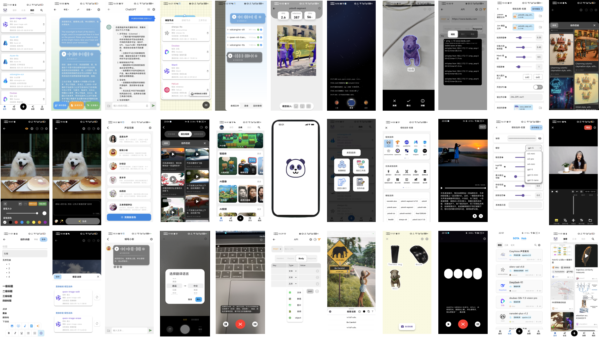

# S.AI - Your Intelligent Companion

<p align="center">
      
</p>

<p align="center">
  <a href="https://github.com/yyccR/S.AI"></a>
  <a href="https://github.com/yyccR/S.AI/issues"></a>
  <a href="https://github.com/yyccR/S.AI/blob/main/LICENSE"></a>
  <a href="https://github.com/yyccR/S.AI/actions/workflows/android.yml"></a>
</p>

<p align="center">
  <a href="https://space.bilibili.com/237133596?spm_id_from=333.788.0.0" style="text-decoration: none;">
    
  </a>
  &nbsp;
  <a href="https://www.xiaohongshu.com/user/profile/647a1290000000001f006dc7" style="text-decoration: none;">
    
  </a>
  &nbsp;
  <a href="https://www.reddit.com/r/SAIapp/" style="text-decoration: none;">
    
  </a>
  &nbsp;
  <a href="https://www.youtube.com/@user-schrodingerai" style="text-decoration: none;">
    
  </a>
</p>

<p align="center">
  <a href="./README_CN.md"></a>
</p>

## 🌟 Introduction
S.AI is a cutting-edge, cross-platform AI application. Designed for seamless interaction and intelligent solutions, S.AI leverages advanced artificial intelligence models to enhance user experience across various devices. Discover the future of intelligent assistance with S.AI.

<p align="center">
  <a href="https://www.bilibili.com/video/BV1KUbkzQEq4/?vd_source=7881b2fbf8a197acadce80dbbf167b51">
    
  </a>
</p>

## ✨ Key Features

S.AI (**S**maller, **S**wifter, **S**marter AI) is a powerful, open-source platform designed for the seamless deployment, release, and utilization of AI models. It offers a comprehensive suite of features, including:

*   **Support Platform:** Run on Android, iOS, Web, and desktop.
*   **Support Framework:** Integrates with TFLite, NCNN, Paddle Lite, ONNX Runtime, MNN, TNN, GGML, and more.
*   **Support Cloud:** Connects to APIs from major cloud providers like Google, Microsoft, and Alibaba.
*   **Support Workflows:** Build adaptive workflows by combining various AI algorithms.
*   **Support self-defined-Apis:** Fetch, parse, and visualize data from custom HTTP sources.
*   **Support Model Management:** Test, evaluate, and publish AI models for mobile and cloud.
*   **Support Hub:** Publish and share innovative AI models or tools.
*   **Support Knowledge:** Access SOTA papers, books, and educational videos.

## 🚀 Quick Start

Follow these steps to get S.AI up and running on your local machine.

### Prerequisites

*   **Flutter SDK (Recommended: FVM)**
    To ensure consistent Flutter SDK versions across your development team, we highly recommend using [Flutter Version Management (FVM)](https://fvm.app/documentation/getting-started/installation).

    **MacOS/Linux:**
    ```bash
    curl -fsSL https://fvm.app/install.sh | bash
    ```

    **Window:** Install FVM using Chocolatey from the command line or PowerShell:
    ```bash
    choco install fvm
    ```
    For other operating systems or detailed installation instructions, please refer to the [FVM official documentation](https://fvm.app/documentation/getting-started/installation).

*   **Platform-Specific Dependencies**
    For detailed instructions on setting up platform-specific dependencies like the Android SDK, NDK, and Xcode, please refer to our [Additional Installation Guide](./docs/ADDITIONAL_INSTALLATION.md).

### Installation

1.  **Clone the repository:**
    ```bash
    git clone https://github.com/yyccR/S.AI.git
    cd S.AI
    ```

2.  **Install Flutter dependencies (using FVM 3.27.4):**
    Ensure FVM is set up and then use Flutter version 3.27.4:
    ```bash
    fvm install 3.27.4
    fvm use 3.27.4
    flutter pub get
    ```

3.  **Running the Application**
    Connect a device or start an emulator, then run:

    ```bash
    fvm flutter run
    ```

    For specific platforms:

    *   **To get device ID:** Run `fvm flutter devices` to list available devices and their IDs.
    *   **Android:** `fvm flutter run --device-id <your_android_device_id>`
    *   **iOS:** `fvm flutter run --device-id <your_ios_device_id>`
    *   **Web:** `fvm flutter run -d chrome` (or your preferred browser)
    *   **Desktop (Windows/macOS/Linux):** `fvm flutter run -d <platform>` (e.g., `fvm flutter run -d windows`)

## 🖼️ Project Preview

See S.AI in action:

<!-- Add more screenshots or a GIF here if available -->

## ⬇️ Download

S.AI is available on multiple platforms. Click the links below to download:

*   **Android:** [Download APK (Coming Soon)]()
*   **iOS:** [Download on App Store (Coming Soon)]()
*   **Web:** [Launch Web App (Coming Soon)]()
*   **Windows:** [Download Installer (Coming Soon)]()
*   **macOS:** [Download DMG (Coming Soon)]()
*   **Linux:** [Download AppImage/Deb/RPM (Coming Soon)]()

## 🗓️ Release Plan

We are committed to continuously improving S.AI. Here's a glimpse of our future plans:

*   **2025 Q3 (v1.1):** Expand support for more ONNX, TFLite, and cloud models.
*   **2025 Q4 (v1.2):** Introduce workflow functionality with support for logical computation and tool nodes.
*   **2026 Q1 (v1.3):** Launch a Hub space for model downloading and sharing.

Stay tuned for more exciting developments!
## 💡 Supported Frameworks and Models

|                                                                                Model                                                                                 | Type | Framework(s) |                 Task Type                  |
|:--------------------------------------------------------------------------------------------------------------------------------------------------------------------:|:--:|:--:|:------------------------------------------:|
|                                                         [nanodet plus](https://github.com/RangiLyu/nanodet)                                                          | `local model` | `ncnn` |             `目标检测`<br/>`Object Detection`             |
|                                                           [yolov5](https://github.com/ultralytics/yolov5)                                                            | `local model` | `tflite` |             `目标检测`<br/>`Object Detection`             |
|                                            [yolov5 (v6.0 ~ v7.0)](https://github.com/ultralytics/yolov5/releases/tag/6.0)                                            | `local model` | `ncnn` |             `目标检测`<br/>`Object Detection`             |
|                                               [yolov5-segment](https://github.com/ultralytics/yolov5/releases/tag/7.0)                                               | `local model` | `ncnn` |          `实例分割`<br/>`Instance Segmentation`           |
|                                                         [yolov5-lite](https://github.com/ppogg/YOLOv5-Lite)                                                          | `local model` | `onnxruntime` |             `目标检测`<br/>`Object Detection`             |
|                                                             [yolov6](https://github.com/meituan/YOLOv6)                                                              | `local model` | `tnn` |             `目标检测`<br/>`Object Detection`             |
|                                                            [yolov7](https://github.com/WongKinYiu/yolov7)                                                            | `local model` | `paddle lite` |             `目标检测`<br/>`Object Detection`             |
|                                                        [yolox](https://github.com/Megvii-BaseDetection/YOLOX)                                                        | `local model` | `mnn` |             `目标检测`<br/>`Object Detection`             |
|                                                        [PPOCR-v5](https://github.com/PaddlePaddle/PaddleOCR)                                                         | `local model` | `ncnn` |                   `光学字符识别`<br/>`OCR`                    |
|                                                       [yolov8](https://docs.ultralytics.com/zh/models/yolov8/)                                                       | `local model` | `ncnn` |             `目标检测`<br/>`Object Detection`             |
|                                                    [yolov8-pose](https://docs.ultralytics.com/zh/models/yolov8/)                                                     | `local model` | `ncnn` |             `姿态估计`<br/>`Pose Estimation`              |
|                                                   [yolov8-segment](https://docs.ultralytics.com/zh/models/yolov8/)                                                   | `local model` | `ncnn` |          `实例分割`<br/>`Instance Segmentation`           |
|                                                     [yolov8-obb](https://docs.ultralytics.com/zh/models/yolov8/)                                                     | `local model` | `ncnn` | `旋转目标检测`<br/>`Oriented Bounding Boxes Object Detection` |
|                                                     [yolov8-cls](https://docs.ultralytics.com/zh/models/yolov8/)                                                     | `local model` | `ncnn` |           `图片分类`<br/>`Image Classification`           |
|                                                 [yolov8-worldv2](https://docs.ultralytics.com/zh/models/yolo-world)                                                  | `local model` | `ncnn` |             `目标检测`<br/>`Object Detection`             |
|                                                       [yolov9](https://docs.ultralytics.com/zh/models/yolov9/)                                                       | `local model` | `ncnn` |             `目标检测`<br/>`Object Detection`             |
|                                                       [yolov11](https://docs.ultralytics.com/zh/models/yolo11)                                                       | `local model` | `ncnn` |             `目标检测`<br/>`Object Detection`             |
|                                                    [yolov11-pose](https://docs.ultralytics.com/zh/models/yolo11/)                                                    | `local model` | `ncnn` |             `姿态估计`<br/>`Pose Estimation`              |
|                                                    [yolov11-seg](https://docs.ultralytics.com/zh/models/yolo11/)                                                     | `local model` | `ncnn` |          `实例分割`<br/>`Instance Segmentation`           |
|                                                    [yolov11-obb](https://docs.ultralytics.com/zh/models/yolo11/)                                                     | `local model` | `ncnn` | `旋转目标检测`<br/>`Oriented Bounding Boxes Object Detection` |
|                                                        [yolo-nas](https://github.com/Deci-AI/super-gradients)                                                        | `local model` | `onnxruntime` |             `目标检测`<br/>`Object Detection`             |
|                                                      [sherpa-ncnn (stt)](https://github.com/k2-fsa/sherpa-ncnn)                                                      | `local model` | `ncnn` |         `音频识别`<br/>`Auto Speech Recognition`          |
|                                                      [sherpa-onnx (tts)](https://github.com/k2-fsa/sherpa-onnx)                                                      | `local model` | `onnxruntime` |              `文字转语音`<br/>`Text To Speech`              |
|                                                             [whisper](https://github.com/openai/whisper)                                                             | `local model` | `tflite`<br/>`ggml` |         `音频识别`<br/>`Auto Speech Recognition`          |
|                                                        [paddleocr](https://github.com/PaddlePaddle/PaddleOCR)                                                        | `local model` | `paddle lite` |      `光学字符识别`<br/>`OCR`       |
|                                                   [chineseocr_lite](https://github.com/DayBreak-u/chineseocr_lite)                                                   | `local model` | `ncnn` |      `光学字符识别`<br/>`OCR`       |
|                                                           [deep sort](https://github.com/nwojke/deep_sort)                                                           | `local model` | `ncnn` |             `目标追踪`<br/>`Object Tracking`              |
|                                                            [Real-SR](https://github.com/Tencent/Real-SR)                                                             | `local model` | `ncnn` |             `超分辨`<br/>`Super Resolution`             |
|                                                           [ESRGAN](https://github.com/xinntao/Real-ESRGAN)                                                           | `local model` | `ncnn` |             `超分辨`<br/>`Super Resolution`             |
|                                                 [silero-vad (v5)](https://github.com/snakers4/silero-vad/tree/v5.0)                                                  | `local model` | `onnxruntime` |         `语音活动检测`<br/>`Voice Activity Detection`         |
|                                                 [silero-vad (v4)](https://github.com/snakers4/silero-vad/tree/v4.0)                                                  | `local model` | `onnxruntime` |         `语音活动检测`<br/>`Voice Activity Detection`         |
|                                               [ChatGPT](https://platform.openai.com/docs/api-reference/authentication)                                               | `cloud model` | `chatgpt` |             `文本生成`<br/>`Text Generation`              |
|                                                   [OpenAI Vision](https://platform.openai.com/docs/guides/vision)                                                    | `cloud model` | `openai` |        `视觉问答`<br/>`Visual Question Answering`         |
|                                                      [Moonshot](https://platform.moonshot.cn/docs/intro#文本生成模型)                                                      | `cloud model` | `moonshot` |             `文本生成`<br/>`Text Generation`              |
|                                                     [Doubao](https://team.doubao.com/zh/?view_from=homepage_tab)                                                     | `cloud model` | `豆包` |             `文本生成`<br/>`Text Generation`              |
|                                                 [Doubao Vision](https://team.doubao.com/zh/?view_from=homepage_tab)                                                  | `cloud model` | `豆包` |        `视觉问答`<br/>`Visual Question Answering`         |
|                                                                [DeepSeek](https://www.deepseek.com/)                                                                 | `cloud model` | `DeepSeek` |             `文本生成`<br/>`Text Generation`              |
|                                                           [Gemini](https://ai.google.dev/gemini-api/docs)                                                            | `cloud model` | `Gemini` |             `文本生成`<br/>`Text Generation`              |
|                                                         [Claude](https://docs.anthropic.com/en/api/overview)                                                         | `cloud model` | `Claude` |             `文本生成`<br/>`Text Generation`              |
|   [Qwen](https://bailian.console.aliyun.com/console?tab=api#/api/?type=model&url=https%3A%2F%2Fhelp.aliyun.com%2Fdocument_detail%2F2833609.html&renderType=iframe)   | `cloud model` | `通义` |             `文本生成`<br/>`Text Generation`              |
| [Wanx 2.1](https://bailian.console.aliyun.com/console?tab=api#/api/?type=model&url=https%3A%2F%2Fhelp.aliyun.com%2Fdocument_detail%2F2867393.html&renderType=iframe) | `cloud model` | `通义` |             `图像生成`<br/>`Image Generation`             |
|                                                    [智谱清言](https://docs.bigmodel.cn/cn/guide/start/model-overview)                                                    | `cloud model` | `智谱清言` |             `文本生成`<br/>`Text Generation`              |
|                                                        [CosyVoice](https://github.com/FunAudioLLM/CosyVoice)                                                         | `cloud model` | `funAudiollm` |              `文字转语音`<br/>`Text To Speech`              |
|                                                       [Fish-Speech](https://github.com/fishaudio/fish-speech)                                                        | `cloud model` | `Fish.Audio` |              `声音克隆`<br/>`Voice Cloning`               |
|                                                         [GPT-SoVITS](https://github.com/RVC-Boss/GPT-SoVITS)                                                         | `cloud model` | `none` |              `声音克隆`<br/>`Voice Cloning`               |
|                                                   [LTX (ComfyUI)](https://github.com/Lightricks/ComfyUI-LTXVideo)                                                    | `cloud model` | `comfyUI` |             `视频生成`<br/>`Video Generation`             |
|                                               [CogVideoX (ComfyUI)](https://github.com/kijai/ComfyUI-CogVideoXWrapper)                                               | `cloud model` | `comfyUI` |             `视频生成`<br/>`Video Generation`             |
|                                                                    [拍我AI](https://pai.video/home)                                                                    | `cloud model` | `拍我AI` |             `视频生成`<br/>`Video Generation`             |
|                                                                 [PixVerse](https://app.pixverse.ai/)                                                                 | `cloud model` | `PixVerse` |             `视频生成`<br/>`Video Generation`             |
|                                                  [Hailuo (MiniMax)](https://www.minimax.io/news/minimax-hailuo-02)                                                   | `cloud model` | `MINIMAX` |             `视频生成`<br/>`Video Generation`             |
|                                   [Kling](https://app.klingai.com/global/dev/document-api/quickStart/productIntroduction/overview)                                   | `cloud model` | `可灵` |             `视频生成`<br/>`Video Generation`             |
|                                                         [即梦](https://www.volcengine.com/docs/85621/1544716)                                                          | `cloud model` | `即梦` |             `视频生成`<br/>`Video Generation`             |
|                                                         [Vidu](https://platform.vidu.com/docs/introduction)                                                          | `cloud model` | `Vidu` |             `视频生成`<br/>`Video Generation`             |
|                                                    [Volcengine STT](https://www.volcengine.com/docs/6561/163032)                                                     | `cloud model` | `火山引擎` |         `音频识别`<br/>`Auto Speech Recognition`          |
|                                 [Azure STT](https://learn.microsoft.com/zh-tw/azure/ai-services/speech-service/index-speech-to-text)                                 | `cloud model` | `微软云` |         `音频识别`<br/>`Auto Speech Recognition`          |
|                                                    [Volcengine TTS](https://www.volcengine.com/docs/6561/163032)                                                     | `cloud model` | `火山引擎` |              `文字转语音`<br/>`Text To Speech`              |
|        [Azure TTS](https://learn.microsoft.com/zh-cn/azure/ai-services/speech-service/get-started-text-to-speech?tabs=macos&pivots=programming-language-rest)        | `cloud model` | `微软云` |              `文字转语音`<br/>`Text To Speech`              |
|                                                    [Volcengine OCR](https://www.volcengine.com/docs/6790/117730)                                                     | `cloud model` | `火山引擎` |      `光学字符识别`<br/>`OCR`       |
|                                                  [Volcengine Translate](https://www.volcengine.com/docs/4640/65067)                                                  | `cloud model` | `火山引擎` |           `机器翻译`<br/>`Machine Translation`            |
|                                           [Qwen-MT Translate](https://help.aliyun.com/zh/model-studio/machine-translation)                                           | `cloud model` | `通义` |           `机器翻译`<br/>`Machine Translation`            |
|                                     [Qwen Image Edit](https://bailian.console.aliyun.com/?tab=api#/api/?type=model&url=2976416)                                      | `cloud model` | `通义` |                `图像编辑`<br/>`Image Edit`                |
|                                     [Qwen Image Erase](https://bailian.console.aliyun.com/?tab=api#/api/?type=model&url=2840907)                                     | `cloud model` | `通义` |             `图像修复`<br/>`Image Inpainting`             |
|                                              [Nano Banana](https://ai.google.dev/gemini-api/docs/image-generation#rest)                                              | `cloud model` | `Gemini` |             `图像生成`<br/>`Image Generation`             |

## 💬 Community & Contact

*   **GitHub Discussions:** Best for sharing feedback and asking questions. (Link to your GitHub Discussions)
*   **GitHub Issues:** Best for reporting bugs and proposing features. (Link to your GitHub Issues)
*   **QQ Group:** Join our QQ group for technical discussions and community interaction. (QQ Group Number: 728382168)

## 👋 Contributing

We welcome contributions to S.AI! Please see our [Contribution Guide](LINK_TO_CONTRIBUTING_GUIDE) for more information on how to get started.

## 📜 License

S.AI is licensed under a modified version of the Apache License 2.0, with the following additional conditions:

1.  **Authorization:** If you want to use S.AI in your company's commercial products, regardless of whether there is a profit-making behavior or not, you must obtain written authorization from the producer of S.AI. Otherwise, using the S.AI source code to build and release your products is not allowed.

2.  **LOGO and copyright information:** When integrating the S.AI source code into your products or interfaces, you shall not remove or modify the LOGO and copyright information of the S.AI application.

3.  **As a contributor, you should agree that:**
    a. The producer can adjust the open-source agreement to be either more stringent or more lenient as deemed necessary.
    b. The code you contribute may be used for commercial purposes, including but not limited to cloud business operations.

Except for the specific conditions mentioned above, all other rights and restrictions are in accordance with the Apache License 2.0. Detailed information about the Apache License 2.0 can be found at http://www.apache.org/licenses/LICENSE - 2.0.

The unique interface design and interactive elements of S.AI are protected by relevant patents and intellectual property laws.

© 2025 S.AI


